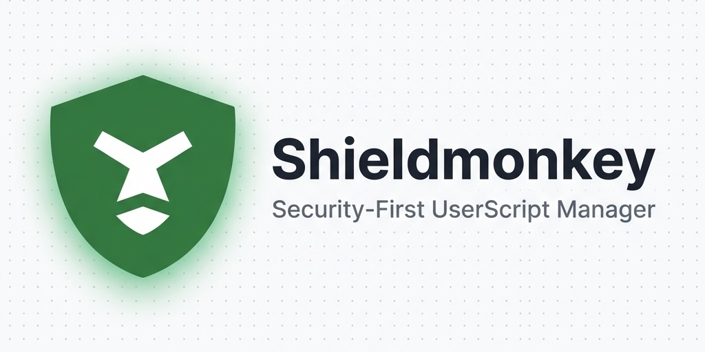

[](https://github.com/Shieldmonkey/Shieldmonkey/actions/workflows/ci.yml)
[](https://github.com/Shieldmonkey/Shieldmonkey/actions/workflows/test.yml)
[](https://github.com/Shieldmonkey/Shieldmonkey/commits/main)
[](https://github.com/Shieldmonkey/Shieldmonkey/issues)
[](LICENSE)


[日本語版 README (Japanese)](README.ja.md)



# Shieldmonkey

Shieldmonkey is an open-source, Manifest V3 compliant userscript manager designed with security and auditability as the top priorities.

## Design and Features

### Strict Content Security Policy (CSP)
Shieldmonkey enforces a strict Content Security Policy (CSP) to prevent the extension from communicating with external entities unintentionally.
External connections from Background Scripts and injected pages are blocked. Consequently, the following features are intentionally excluded:

- Functions that bypass CORS, such as `GM_xmlHttpRequest`
- Dynamic loading of external scripts via `require`
- Automatic backup to cloud services
- Automatic script updates

All updates are performed manually by the user, preventing unintentional code replacement or execution in the background.

### Auditable Builds
To ensure transparency, we follow these build policies:

- The source code of the built extension is intentionally not minified (compressed or obfuscated) to prioritize ease of auditing.
- SourceMaps are included for debugging and verification.
- A minified version is also provided for distribution size considerations, but we recommend using the non-minified version.

We provide manual installation from GitHub as an option for users who prioritize auditability and control. You can choose between the convenience and review process of the Browser Stores, or the security of using a fixed, auditable version built from source.

### Supply Chain Security
We prioritize supply chain security by leveraging `pnpm` configuration and strict versioning policies.

- **Strict Version Pinning (package.json)**: All dependencies in `package.json` are pinned to exact versions (no `^` or `~`). We do not use range specifiers, ensuring that the exact same code is used across all builds.
- **`pnpm-workspace.yaml` Configuration**:
  - **`blockExoticSubdeps=true`**: Prevents installation of dependencies from untrusted sources (e.g., Git URLs), ensuring all packages come from the registry.
  - **`minimumReleaseAge=10080`**: We only install packages that have been published for at least 7 days. This mitigates the risk of installing newly compromised packages (zero-day malicious updates).
  - **`trustPolicy=no-downgrade`**: Prevents dependencies from being silently downgraded to older versions.
- **`ignore-scripts`**: Script execution is disabled by default in `pnpm`. We also explicitly set `ignore-scripts=true` in `.npmrc` as a fallback for `npm` users, preventing malicious build scripts from running.
- **Immutable Lockfile**: We enforce `lockfile=true` and use `pnpm install --frozen-lockfile` in CI to ensure reproducible builds.

## Features

- Script management (install, edit, delete, disable)
- Editing environment powered by CodeMirror 6
- `.user.js` format support
- Local import/export

## Tech Stack

- React 19
- Vite (w/ CRXJS)
- TypeScript
- CodeMirror 6
- IndexedDB
- Vanilla CSS / Sass

## Installation and Build

1. Clone the repository
   ```bash
   git clone https://github.com/shieldmonkey/shieldmonkey.git
   cd shieldmonkey
   ```

2. Install dependencies
   Since `ignore-scripts=true` is set in `.npmrc`, you can safely install dependencies using:
   ```bash
   pnpm install
   ```

3. Build
   ```bash
   pnpm run build
   ```

4. Load the extension
   Open `chrome://extensions` in Chrome, enable Developer Mode, and load the generated `dist` directory.

## testing

You can run E2E tests to verify Shieldmonkey's functionality.

```bash
# Install Playwright Browsers (first time only)
pnpm exec playwright install chromium --with-deps

# Build the extension
pnpm run build

# Run E2E tests
pnpm run test:e2e
```

Tests include:
- Script installation and import
- Script management on the options page (create, edit, delete)
- Backup and restore functionality
- CSP policy verification
- Popup page behavior check
